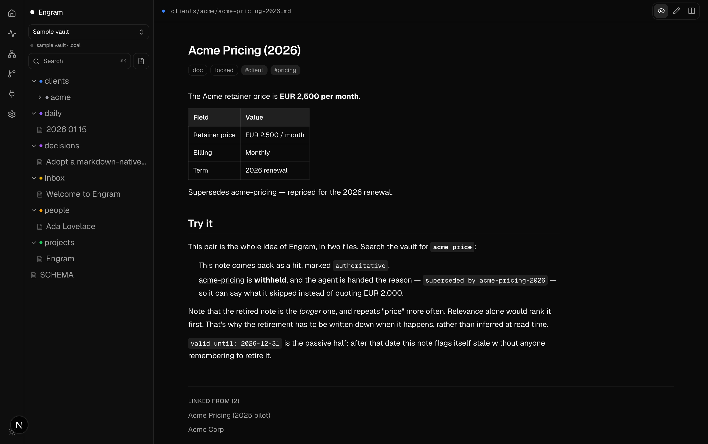

<p align="center">
  
</p>

<h1 align="center">Engram</h1>

<p align="center"><b>The second brain your AI agents read and write.</b></p>

<p align="center">
  <a href="https://github.com/rwnalds/engram/blob/main/assets/demo.mp4">
    
  </a>
</p>

<p align="center"><sub><a href="https://github.com/rwnalds/engram/blob/main/assets/demo.mp4">▶ Watch the full-length video</a> (real-time, full quality)</sub></p>

---

Engram is a self-hosted **MCP server + dashboard** that gives Claude Code, Cursor, Hermes, and any
[Model Context Protocol](https://modelcontextprotocol.io) agent **shared, long-term memory they read
_and write_** — over a plain, **git-backed folder of markdown you own**. Built for the case a single
agent's memory never hits: **a team running several agents against one brain.**

Autonomous agents forget everything between sessions — and worse, they can't tell what they remember
is _still true_. An agent pulls an old README, a retired price, an API doc you changed months ago, and
quotes it with full confidence, because keyword and vector search both rank by resemblance, not truth.
Engram makes **"is this still true"** a first-class, written property: mark a fact superseded or
expired and search **withholds it — and tells the agent what it skipped and why.** Per-agent read/write
tokens and a git audit trail of who-wrote-what keep it sane when the writers are a fleet, not just you.

Unlike a headless memory store, **you can watch it happen.** A fast dashboard lets you **search your
brain**, see exactly what every agent and teammate changed (with per-file **diffs**), **jump back** into
recent notes, and curate it all — while agents read and write the same vault over one MCP endpoint. No
database: your `.md` files are the source of truth, git is the durable store, and an in-memory index
powers full-text search + a wikilink **knowledge graph**.

[](https://railway.com/deploy/engram?referralCode=PEidIe&utm_medium=integration&utm_source=template&utm_campaign=generic)
[](https://render.com/deploy?repo=https://github.com/rwnalds/engram)

[](https://github.com/rwnalds/engram/actions/workflows/ci.yml)
[](./LICENSE)
[](https://github.com/rwnalds/engram/pkgs/container/engram)

> **Opinionated about _how_ it stores memory** — git-backed markdown, no database, agents write (not
> just read), self-hosted. **Unopinionated about _what_ you keep in it** — any markdown vault, any folder
> structure, any MCP client. Point it at a fresh repo or your existing **Obsidian vault**: no import
> step, no lock-in.

---

**[What it's for](#what-its-for)** · **[How it compares](#how-it-compares)** · **[Features](#features)** ·
**[Works with](#works-with)** · **[Quick start](#quick-start)** · **[MCP tools](#mcp-tools)** ·
**[Deploy](#deploy)** · **[FAQ](#faq)** · **[Contributing](#contributing)**

---

## What it's for

- **Shared memory for a team running multiple agents** — one vault, many agents reading and writing
  concurrently, with per-agent read/write tokens and a git audit trail of who changed what.
- **Memory that knows what's still true** — retire a price, a term, or a changed API doc and your agents
  stop quoting it; they're told what they skipped and why. The failure a single agent's memory never fixes.
- **Long-term memory for Claude Code** and other coding agents — stop re-explaining your project every session.
- **A self-hosted, Obsidian-compatible second brain** exposed over MCP — your notes, your server, your git repo.
- **Memory you can see, not a black box** — a dashboard to search, watch (with diffs), and curate what your agents remember.
- **Markdown RAG without the vector database** — full-text search + a link graph over human-readable files.

## How it compares

Most agent memory is built to answer *"what did I store about this?"* Engram is built to answer
*"what is still true about this?"* — a different question, and the one that bites when an agent
quotes a price you retired months ago.

| | **Engram** | Vector-store memory<br><sub>(mem0, Zep, …)</sub> | Markdown memory<br><sub>(Basic Memory, …)</sub> | Plain RAG over docs |
|---|---|---|---|---|
| **Storage** | markdown files, git is the database | embeddings in a vector DB | markdown files | embeddings in a vector DB |
| **Ranking** | relevance **× authority** | similarity | relevance | similarity |
| **Knows a fact is retired** | ✅ `superseded_by` + `valid_until`, enforced at search | — | — | — |
| **Explains what it withheld** | ✅ `excluded[]` with a reason per note | — | — | — |
| **Retire + replace atomically** | ✅ `brain_supersede`, one commit | — | — | — |
| **Refuses contradicting writes** | ✅ at write time, not read time | — | — | n/a (read-only) |
| **Audit trail** | ✅ git, per-write attribution, per-file diffs | varies | git, if you commit | — |
| **Per-agent access control** | ✅ read / write token scopes | varies | — | — |
| **Human UI** | ✅ dashboard, search, diffs, graph | varies | — | — |
| **Runs on** | your box, one container | mostly hosted SaaS | your box | your box |

The row that matters is the third one. Similarity search cannot tell a contradiction from a
duplicate — a retired price and a live one are textually identical, so the retired one often
*outranks* the live one by being longer and more detailed. That can't be fixed at read time, which
is why Engram writes the retirement down when it happens.

<p align="center">
  
</p>

<p align="center"><sub>This exact pair ships in <code>sample-vault/</code>. Run <code>bun dev</code>, search <code>acme price</code>,
and watch the retired note get withheld with a reason.</sub></p>

<sub>Categories, not feature-by-feature audits of specific products, and accurate to the best of my
knowledge as of July 2026. If something here misrepresents a tool you maintain, open a PR — I'll fix it.</sub>

## Features

- **MCP server** — 15 `brain_*` tools over one bearer-authenticated HTTP endpoint (`POST /api/mcp`,
  streamable HTTP JSON-RPC). Connect any MCP client to a single URL. **Per-agent token scopes**:
  a read-only token never even sees the write tools.
- **Human dashboard** — a **search-first home**, file tree, note viewer with **Obsidian callouts,
  wikilinks, and backlinks**, Preview / Edit / Split editor with autosave, ⌘K search + **in-page keyboard
  navigation**, "jump back in" recents, and a **force-directed knowledge graph**.
- **Authority-aware search** — ranking knows **relevance, not truth**, so a superseded note repeats your
  query words as often as the live one. Every hit carries an **authority** (`authoritative` → `current`
  → `provisional` → `superseded` → `archived`) derived from the note's folder and frontmatter — so your
  agents quote the locked doc, not the dead one. Markdown RAG that won't hand back yesterday's answer.
- **Temporal validity + explainable rejection** — mark a fact `superseded_by` another note or give it a
  `valid_until` date, and search **withholds it by default** (even if it's `locked`) — then hands the
  agent an `excluded` list of what it skipped, each with a reason (`"expired 2026-06-01"`). One atomic
  **`brain_supersede`** retires the old fact and links the new one in a single commit, so add-and-retire
  can't drift apart. This is the difference between an agent that *remembers* and one that knows what's
  **still true**.
- **Write-time contradiction guards** — authority ranking fixes *reading*; these stop the vault
  accepting the contradiction in the first place. Engram refuses to create a second live note on a
  subject a live note already covers (the `acme-pricing-2026.md`-beside-`acme-pricing.md` bug) and
  points the agent at `brain_supersede` instead; refuses to overwrite a note the caller hasn't read;
  and warns when a `status:` isn't a word the ranking model knows, so a typo can't silently strip a
  note's authority.
- **Audit trail + access control** — every write is attributed in **git** to the token or human that
  made it, with expandable **per-file diffs** in the activity feed. Give an agent a **read-only token**
  and it never even sees the write tools; a **write** token can create, edit, move, and archive.
- **The Curator** *(optional)* — Engram's built-in **agent harness** over your vault. **Chat** with your
  notes (grounded answers, wikilink citations). Or hand `brain_capture` a rough dump — a meeting note, a
  voice transcript — and an **agentic loop searches what already exists, then files, merges, or archives**
  and returns a manifest of what it touched. It reads before it overwrites and never deletes. Opus /
  Sonnet / Haiku, your key.
- **Markdown-native** — plain `.md` + YAML frontmatter + `[[wikilinks]]`. Drop in an existing
  **Obsidian vault** and it just works.
- **Git-backed** — optional auto commit + push of every change. Full history, no lock-in, your data
  lives in **your** repo.
- **No database** — files are the source of truth; an in-memory MiniSearch index + a ported wikilink
  graph power search and backlinks. Nothing to provision.
- **Multi-workspace** — connect multiple vault repos (URL + token or GitHub OAuth), rename, switch the
  active one, or remove them — all from the UI.
- **Self-hosted** — one Docker container. Railway / Render / Fly / any host with a volume.
  **Not** serverless (it needs a persistent volume, a file watcher, and a long-running index).
- **Team auth** — Google SSO + email allowlist for the dashboard; per-agent bearer tokens — or **OAuth
  for Claude.ai custom connectors** — for MCP, created/revoked in the UI. Secrets encrypted at rest.
- **Runtime config** — toggle git-sync and the Curator right from the home; manage commit author, keys,
  and OAuth in **Settings** — no redeploy.

## Works with

Any client that speaks the **Model Context Protocol** — one endpoint, bearer-token auth. Most-used first:

- **[Claude Code](https://claude.com/claude-code)** — Anthropic's agentic coding CLI
- **Codex** — OpenAI's coding agent (CLI + IDE)
- **Hermes** — always-on autonomous agent runtime
- **openclaw** — open-source coding agent
- **Cursor** — AI code editor
- **Cline** — VS Code agent
- **Windsurf** — agentic IDE
- **Claude Desktop** — Anthropic's desktop app
- …and any other MCP client — Continue, Goose, Zed, Amp, and the rest

If it speaks MCP, it can read and write Engram as shared memory.

## Quick start

```bash
bun install
bun dev            # http://localhost:3000 — runs against ./sample-vault
```

Point it at your own vault:

```bash
VAULT_DIR=/path/to/your/obsidian-or-markdown/vault bun dev
```

### Two ways to run it

- **Hosted mode (team):** the dashboard + HTTP MCP server above — self-host it once, many agents and
  teammates connect over `POST /api/mcp`. This is the main mode.
- **Local mode (stdio):** a plain stdio MCP server over a folder, no HTTP/auth/git — for a single
  machine, Claude Desktop / Cursor, or a registry's Docker introspection:

  ```bash
  bun run mcp:stdio /path/to/your/vault      # defaults to ./sample-vault
  ```

  Same `brain_*` tools. Image: `Dockerfile.mcp` (`CMD ["bun", "scripts/mcp-stdio.ts"]`).

## MCP tools

Agents only ever see the active vault — no repo, workspace, or GitHub tools are exposed.
A `read`-scope token sees only the read tools. `brain_capture` appears only when the Curator is `full`.

| | Tools |
|---|---|
| **Read** | `brain_search` · `brain_read` · `brain_list` · `brain_recent` · `brain_tree` · `brain_backlinks` · `brain_graph` · `brain_schema` |
| **Write** (needs a `write`-scope token) | `brain_write` · `brain_edit` · `brain_append` · `brain_move` · `brain_supersede` · `brain_create_folder` · `brain_delete` |

Connect an agent (the dashboard → **Connect** page shows the exact command + token):

```bash
claude mcp add --transport http engram https://<host>/api/mcp \
  --header "Authorization: Bearer <token>"
```

## Deploy

Runs anywhere you can run a Docker container with a persistent volume — Railway, Render, Fly, or your
own box. **Serverless (Vercel) won't work**: Engram holds a volume, a file watcher, and an in-memory
index that a serverless function can't keep alive.

1. Deploy this repo (root `Dockerfile`), mount a volume at `/data`, set `ENGRAM_DATA_DIR=/data`.
2. Connect your vault repo(s) **in the dashboard** (Workspaces) — by URL + token, or GitHub OAuth.
3. Sign in with Google, create MCP tokens on the **Connect** page, point your agents at the URL.

Most runtime config (git-sync, AI capture, GitHub OAuth, app name) is editable in the **Settings**
page — only auth/infra bootstrap vars live on the host. Full setup: **[DEPLOY.md](./DEPLOY.md)**.

- **Railway:** New Project → *Deploy from GitHub repo* → add a Volume at `/data`.
- **Render:** one-click via the bundled `render.yaml` (Docker + a `/data` disk).

## FAQ

**How do I give Claude Code long-term memory?**
Deploy Engram, connect a markdown vault, and `claude mcp add` the endpoint. The `brain_*` tools let
Claude Code search, read, and write persistent notes across sessions.

**Can multiple AI agents share one knowledge base?**
Yes. Every agent points at the same MCP URL and reads/writes the same active vault — that's the point.
Give each agent its own bearer token, `read` or `write` — a read-only token can't mutate your notes.

**How do I stop an agent from quoting outdated facts?**
Retire the fact and search stops surfacing it. When a value changes, call **`brain_supersede(old, new)`** —
one atomic commit marks the old note `superseded_by` the new one, and it's **withheld from search by
default** (even if it's `locked`). Or set **`valid_until: 2026-12-31`** on a note and it self-expires.
Retired matches don't vanish silently: `brain_search` returns them in an **`excluded`** list with a
reason (`"expired 2026-06-01"`), so the agent can say *what it ignored and why* instead of quoting it.

**What stops an agent just adding a second, contradicting note?**
Engram refuses the write. Told "the price is now X", an agent that can't overwrite a note it never
read will happily *add* `acme-pricing-2026.md` next to `acme-pricing.md` — nothing is corrupted, and
you now have two live notes disagreeing about one number. That write is rejected with a pointer to
`brain_supersede`, which retires the old note and adds the new one in a single commit. Pass
`allow_conflict: true` when both notes genuinely belong.

**How do I know what an agent changed?**
Every write is committed to git attributed to the token or human behind it, and the dashboard's
activity feed shows per-file diffs — a built-in audit trail for autonomous agents.

**Does it work with my Obsidian vault?**
Yes. It reads plain markdown with frontmatter and `[[wikilinks]]`, and renders Obsidian-style callouts
and backlinks. No import step.

**Do I need a vector database?**
No. Engram uses full-text search (MiniSearch) plus a wikilink graph over human-readable markdown —
no embeddings service, no vector store to run.

**Can I chat with my notes?**
Yes — enable the optional **Curator**, a chat agent that searches and reads your vault to answer with
wikilink citations (Opus / Sonnet / Haiku). It's read-only in chat, so it helps you think without
changing anything, and it runs on your own Anthropic key.

**Can I see what my agents changed?**
Yes — the **Activity** view reads your vault's git history and shows every change (agents and teammates
alike), expandable to per-file diffs. Since it's just git, you get the full audit trail for free.

**Is my data locked in?**
No. It's just `.md` files in a git repo you own. Turn Engram off and you still have every note and its
full history.

**Where does it run / is it self-hosted?**
You host it. One Docker container on Railway / Render / Fly / any VM with a volume. Your keys, your data.

## Contributing

Issues and PRs welcome — especially where the validity model breaks against a vault shaped
differently from mine.

- **[CONTRIBUTING.md](./CONTRIBUTING.md)** — setup, conventions, and the pre-PR checklist.
- **[docs/curator.md](./docs/curator.md)** — how the optional Curator agent loop works.
- **[SECURITY.md](./SECURITY.md)** — please report vulnerabilities privately, not as an issue.

```bash
bun install && bun dev
bun test          # the ranking/authority suite, incl. the stale-truth fixtures
```

If Engram is useful to you, **starring the repo** genuinely helps other people find it.

## Stack

Next.js 16 (App Router) · React 19 · TypeScript · Tailwind v4 · shadcn/ui · bun · MiniSearch ·
d3-force · MCP SDK. **MIT licensed.**

---

<sub>**Keywords:** MCP server · Model Context Protocol · second brain for AI agents · agent memory ·
long-term memory for Claude Code · shared memory for AI agents · self-hosted knowledge base ·
Obsidian-compatible · markdown · knowledge graph · wikilinks · PKM · Zettelkasten · git-backed notes ·
Hermes agent memory · Cursor memory · RAG without a vector database · chat with your markdown notes ·
git-backed agent activity feed · audit trail for AI agents · authority-aware search · read-only vs
write MCP tokens · agent access control · self-organizing notes · agentic note capture · AI that files
your notes · temporal validity · stale memory · agents quoting outdated facts · supersede · note expiry ·
shared memory for a team of agents · Basic Memory alternative · mem0 alternative.</sub>
